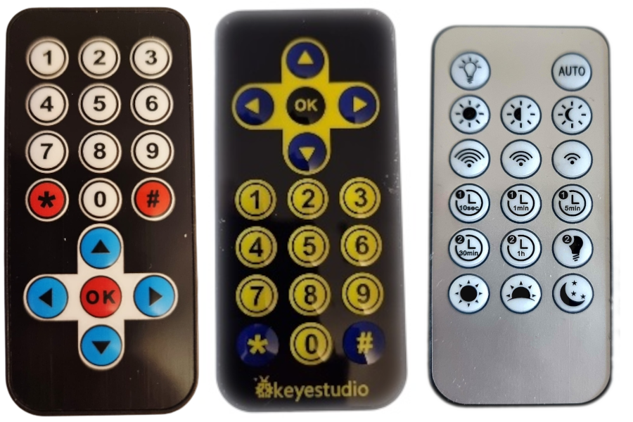
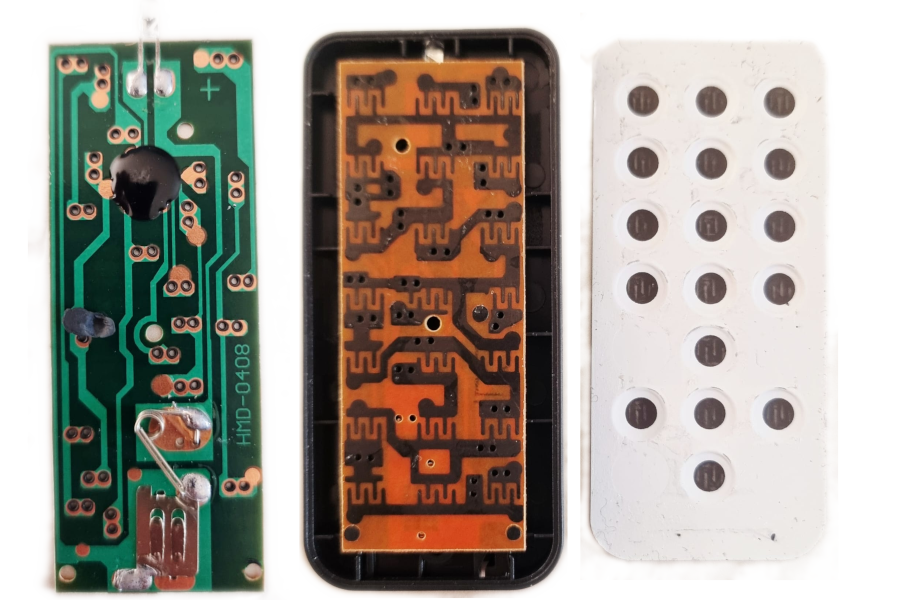

## Remote Control Mapping
  

## 21 Key IR Remote controls

Cheap Chinese IR remote controls powered by a CR3220 coin cell often feature a 3×7 (21) key matrix, though some positions may be unused depending on the variant.  
Most use the [SC6122 IC](./SC6122.PDF), typically implemented as a COB (Chip-On-Board), where the bare silicon die is directly mounted and wire-bonded onto the PCB rather than packaged and covered with an epoxy 'Glob-on-Top'. 
These remotes generally transmit signals using the [NEC IR protocol](https://www.sbprojects.net/knowledge/ir/nec.php), modulated at 38 kHz, with standard NEC timing (logical ‘0’ ≈ 562 µs pulse + 562 µs space, logical ‘1’ ≈ 562 µs pulse + 1.687 ms space). 
## Internals
  

## Mappings
There is no standard mapping from key position to raw IR code, so codes vary between models and manufacturers. This extension was created to make it easier to integrate the various RC models into your micro:bit project.

## Adding a new RC model

1. Determine the raw IR codes for your RC model, e.g. using [ShowRawIRCode](https://github.com/RoboraceMSW/ShowRawIRCode)
2. Edit 

 

## Gebruiken als extensie

Deze repository kan worden toegevoegd als **extensie** in MakeCode.

* open [https://makecode.microbit.org/](https://makecode.microbit.org/)
* klik op **Nieuw project**
* klik op **Extensies** onder het tandwielmenu
* zoeken naar **https://github.com/roboracemsw/remotecontrolmapping** en importeren

## Dit project bewerken

Om deze repository te bewerken in MakeCode.

* open [https://makecode.microbit.org/](https://makecode.microbit.org/)
* klik op **Importeren** en klik vervolgens op **Importeer URL**
* plak **https://github.com/roboracemsw/remotecontrolmapping** en klik op importeren

#### Metadata (gebruikt voor zoeken, rendering)

* for PXT/microbit

